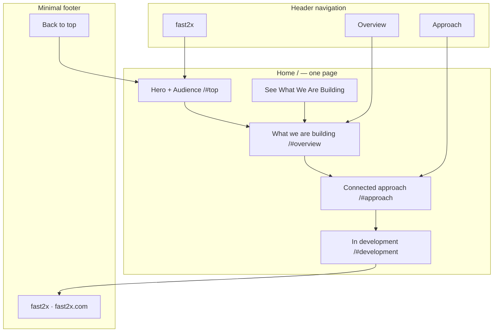

# fast2x 官网结构调整方案 v1.2

日期：2026-09-28  
状态：**用户已确认，已应用到 Figma 主稿、滚动预览、文案与交付记录。未修改页面代码或线上网站。**  
方法：site-architecture；中文说明，面向访客的导航和文案使用英语。

## 1. 建议结论

继续采用 **1 个宣传首页**，把当前 **5 个正文区块压缩为 4 个**。将适用客户融入首屏，把主要阅读顺序调整为：

**这是什么、适合谁 → 正在建设什么 → 为什么把这些能力连接起来 → 当前开放状态。**

页头仅保留 **Overview / Approach** 两个站内导航。唯一主按钮改为 **See What We’re Building**，跳转能力概览。开发状态在首屏和结尾清楚出现，暂不单独占用一个页头导航位置。

保留已完成的黑白灰视觉、大标题、结构插画和局部光感预留。彩色仍限于小面积图形、状态圆点和效果。此方案调整信息职责与阅读顺序，不增加独立产品页、营销栏目或转化流程。

## 2. 调整前依据与事实快照

| 项目 | 当前依据 |
| --- | --- |
| 品牌与域名 | fast2x；fast2x.com |
| 语言与市场 | 英语；美国为首个目标市场 |
| 首发客户 | 有实际产品、需要建设和持续运营海外官网的企业；未限定行业、规模或仅实体商品 |
| 业务方向 | 从网站建设到内容管理、持续运行底座 |
| 开放状态 | 全部能力开发中；演示不开放；当前仅初始化宣传 |
| 当前设计 | 单页、5 个正文区块；桌面 1440 × 3396，手机 390 × 约 5102 |
| 当前导航 | Vision / Approach / Status；首屏 CTA 为 Explore the Vision |
| 当前视觉 | 中性背景；局部彩色；光感独立图层和静态示意，未实现动画 |

来源：[定位与首发确认](./04-fast2x定位与首发确认.md)、[精简内容规划 v1.1](./官网精简内容规划_v1.1.md)、[当前 UI 交付](./ui/README.md)、[UI 核验记录](./ui/validation.json)。用户最新要求优先于旧 11 页和 23 页方案。

未发现项目 product-marketing 上下文文件；上述已确认资料足以支持本轮规划。当前缺少线上流量、用户访谈和访问路径数据，以下问题是内容与设计审视结论，不是跳出率或转化率实测。未盘点线上路由，也不假定旧规划路径曾经发布。

本阶段网站目标按优先级为：建立品牌与业务认知、帮助目标客户判断相关性、准确传达建设范围与开放状态。当前不把线索收集或产品接入作为网站目标。

## 3. 现有结构需要调整的地方

| 现状 | 影响判断 | 调整建议 |
| --- | --- | --- |
| H1 为 From first page. To what’s next. | 有视觉感，但脱离正文时无法直接知道 fast2x 做什么 | H1 明确出现 Product websites，保留从建设到运营的主线 |
| Audience 独立占一个区块 | “适合谁”的答案到第二段才完整出现，也增加手机滚动长度 | 融入 Hero 的说明文字，取消独立区块 |
| Vision 导航、Three parts. One foundation. 标题、Explore the Vision 按钮并存 | 同一目的地用了三种偏抽象的称呼 | 导航 Overview；落点标题 What we’re building；CTA 明确表达跳转目的 |
| 能力区与 Approach 都重复建设、内容、运营三件事 | 两段之间的信息增量不足 | 能力区回答“范围”，Approach 回答“为什么连接、如何持续考虑变化” |
| Status 同时可能被理解为系统运行状态 | 当前没有服务状态监控页 | 从主导航移出；保留清晰的 In development 提示及结尾说明 |
| 手机稿约 5102px | 对初始化宣传而言，插画、重复状态和留白占比较高 | 合并 Audience、缩短结尾、收紧移动端能力面板；保留主视觉 |
| 内容稿与 UI 已有不同的英文标题 | 后续设计、开发可能各取一份文案 | 采用方案后同步内容稿、Figma 与交付清单；旧版保留历史标识 |

## 4. 页面层级与视觉站点图

### 4.1 本期页面树

```text
fast2x.com
└── Home (/)
    ├── Hero + Audience (/#top)
    ├── Planned Overview (/#overview)
    ├── Connected Approach (/#approach)
    └── Development State (/#development)
```

这里只有 **一个页面 URL `/`**；其余为同页定位锚点，不是四个独立页面。网站层级保持扁平，不设置多级菜单、栏目聚合页或面包屑。

### 4.2 视觉站点图



图中 Header 的箭头表示锚点导航；Home 内部的顺序表示阅读顺序。Mermaid 中的 We Are 仅为图示文本简化，最终按钮文案为 **See What We’re Building**。

### 4.3 URL 与定位映射

| 类型 | 页面 / 区块 | URL | 父级 | 导航位置 | 优先级 / 状态 |
| --- | --- | --- | --- | --- | --- |
| 页面 | Home | `/` | 无 | 品牌入口 | P0；唯一公开页面提案 |
| 锚点 | Hero + Audience | `/#top` | Home | 品牌、页脚返回顶部 | P0 |
| 锚点 | Planned Overview | `/#overview` | Home | 页头 Overview、首屏 CTA | P0；主要阅读目的地 |
| 锚点 | Connected Approach | `/#approach` | Home | 页头 Approach | P0 |
| 锚点 | Development State | `/#development` | Home | 正文结尾；保留可分享定位 | P0；不占页头导航 |
| 兼容锚点 | 原 Audience | `/#who` | Home | 不再新增入口 | 指向合并后的首屏受众说明 |
| 兼容锚点 | 原 Vision | `/#vision` | Home | 不再新增入口 | 与 `#overview` 落在同一区块 |
| 兼容锚点 | 原 Status | `/#status` | Home | 不再新增入口 | 与 `#development` 落在同一区块 |

英语站首页直接使用 `/`，当前不增加 `/en` 或 `/us` 路径。后续真实页面路径统一小写、单词用连字符；非首页路径建议不带结尾斜杠。

上述旧锚点是设计规划中的兼容约定，尚未确认已有线上外链。实现时可以用旧 ID 的定位元素兼容，所有新增链接使用新 ID。不要把锚点调整当成已经执行的页面重定向，也不要将历史规划路径批量导向首页。

## 5. 四个区块的内容职责

### H01 · Hero + Audience：是什么、适合谁

**保留：** 品牌、开发状态、大标题、短说明、一个主 CTA、概念结构图。  
**合并：** 原 H02 的目标客户信息。  
**移除：** 独立 Audience 大标题区及重复的业务方向解释。

英文提案：

> **In development**  
> **Product websites. From build to operations.**  
> fast2x is developing a connected foundation for businesses with products to share and international websites to build and run.  
> **See What We’re Building**  
> All capabilities are in development. Public demos are not available.

概念图继续说明网站、内容与运行底座之间的关系；避免放大成似乎可点击的产品界面。首屏不新增第二个按钮。美国目标市场保留在内部定位中，不把“美国市场”自动解释成服务地区承诺或美国本地公司身份。

### H02 · Planned Overview：正在建设什么

建议小标题 **Planned scope**，H2 **What we’re building.**。将 Three parts. One foundation. 作为可选的一句辅助表达，不再与区块标题竞争。

| 方向标题 | 英文内容提案 | 信息职责 |
| --- | --- | --- |
| Website creation | A foundation for shaping a clear website around your products and brand. | 建站：围绕产品与品牌组织官网 |
| Content management | A planned way to organize product information and keep website content current. | 内容：产品信息组织与内容维护 |
| Ongoing operations | An operating foundation designed around the work that continues after launch. | 运行：建设后仍需持续处理的网站工作 |

区块统一显示 **All three areas are in development.**，可替代每张面板底部重复的同一状态标签。能力面板不做成假链接，不增加 Details 或 Learn more 按钮。

运行底座暂不展开托管、监控、自动修复、SLA、合规或上线时限，因为这些交付边界尚未确认。三个方向用业务语言命名，不以 Shopify、Strapi、AI Agents 或 SEO/GEO 重新扩张当前架构。

### H03 · Connected Approach：为什么从建设就考虑运营

保留标题 **Think beyond launch day.**，保留 **Planned approach** 标识。内容从“再列一次能力”改成三个时间阶段的考虑：

| 阶段 | 英文内容提案 |
| --- | --- |
| Before launch | Start with your products and the information visitors need to understand them. |
| At launch | Plan how the website and its content will be maintained, alongside how they are built. |
| After launch | Keep product changes and ongoing website needs in view as the business evolves. |

这是建设理念的说明，不是已开放的服务交付步骤。使用紧凑的连续关系图或文字序列，避免再做三张与能力区相似的大卡片。光效不负责传达步骤顺序，静态状态也应完整可读。

### H04 · Development State：现在能做什么

建议从大段宣传结尾收敛为明确的状态区，H2 使用 **Currently in development.**

> All fast2x capabilities are in development. This site introduces the direction we’re building toward. Public demos are not available at this stage.

暂不增加 FAQ、路线图时间表、订阅或联系表单。已有状态说明足以回答目前能否使用和演示两个问题；单独增加 FAQ 会再次重复。

页脚保留 fast2x、fast2x.com、简短定位与 Back to top。删除结尾中第三次重复的三项能力口号；品牌大字可以保留，但不让手机端页脚形成额外整屏。

## 6. 导航与内链规格

### 页头

桌面：`fast2x    Overview    Approach`。品牌在首页回到 `#top`；如未来增加内页，内页品牌统一返回 `/`。

首屏独立保留唯一主按钮 **See What We’re Building → /#overview**。页头不重复增加同一个主按钮，也不放 Demo、Sign in、Get Started、Pricing 或尚未开放的联系入口。

手机保留这两个文字导航。目标是让品牌与两项导航在 390px 下直接可见；在更窄视口或字体放大时允许两行排列，保持点击区域，不通过缩小字号硬塞。当前两项导航无需新增汉堡菜单或抽屉交互。

### 页脚、侧边栏与面包屑

页脚采用单行或紧凑堆叠，不做 Product / Resources / Company 多列空目录。Privacy / Terms 的真实适用文本准备好并形成页面后，才放入页脚。当前不放不可用链接。单页无侧边栏和面包屑，也无需站内搜索。

### 内链表

| 来源 | 文案 / 元素 | 目标 | 用途 |
| --- | --- | --- | --- |
| 页头 | fast2x | `/#top` | 返回定位与起点 |
| 页头 | Overview | `/#overview` | 直接了解建设范围 |
| 页头 | Approach | `/#approach` | 了解持续运营理念 |
| Hero | See What We’re Building | `/#overview` | 唯一主要阅读行动 |
| 页脚 | Back to top | `/#top` | 长页读完后返回起点 |

不为满足链接数量增加重复按钮。当前只有一个页面，不需要内容中心与子主题页网络；所有内容区块均可沿正文顺序读到。Development 保留可直接分享的锚点，但不必每个区块都链接一次。

当前孤立页面检查只覆盖规划：本期单页没有独立孤立内容页；历史 11/23 页均不进入公开导航。这不是对实际线上路由、404 或索引情况的检查。

## 7. 后续扩展：按条件开放

以下是候选路径，不计入本期设计和上线页数，不显示导航占位：

| 候选页 | URL | 何时值得独立成页 | 未来入口 |
| --- | --- | --- | --- |
| Product overview | `/product` | 有可公开的具体范围、真实例子和维护负责人，信息量已明显超出首页概览 | 首页概览 → 产品页；产品页 → 首页 / 有效下一步 |
| Contact | `/contact` | 确认接收渠道、负责人和回复流程，且明确开始受理咨询 | 页头或页脚；页面需有可完成的联系动作 |
| Privacy | `/privacy` | 实际主体与数据处理方式明确，适用文本已准备 | 页脚 |
| Terms | `/terms` | 实际服务与使用边界明确，适用文本已准备 | 页脚 |

隐私与条款的发布时间应结合实际网站及数据处理安排另行确认；这里只列架构位置，不生成或判断法律文本。公开联系也不自动等于开放演示，未来如启用咨询入口仍需分别说明状态。

Blog、Docs、Pricing、Integrations、Solutions 和独立技术能力页继续暂缓。仅有一个技术名词或未来设想，不构成拆页理由。每新增一页，都应有明确的不同问题、充分内容、真实入口和维护责任。

## 8. 对现有 Figma 的调整清单

| 优先级 | 当前对象 | 拟调整 | 保留 |
| --- | --- | --- | --- |
| P0 | Hero：桌面 `57:13` / 手机 `57:157` | H1 明确业务；并入受众；CTA 改名；首次说明不开放演示 | 中性深色、大标题、结构图、局部光效预留 |
| P0 | Audience：`57:59` / `57:180` | 内容合并后移除独立区块 | 受众含义不丢失 |
| P0 | Vision：`57:67` / `57:188` | 名称改 Overview；业务方向名词化；状态提示集中；收紧移动端插画 | 三方向及概念图 |
| P1 | Approach：`57:97` / `57:218` | 讲 Before / At / After launch 的不同考虑，减少与概览重复 | 原标题、规划状态与阅读顺序 |
| P0 | Status：`57:123` / `57:244` | 压缩为 Development 状态说明，缩短手机段落高度 | 全部开发中、演示不开放 |
| P0 | Header / Footer | 两项导航、单一主 CTA、紧凑页脚；更新锚点 | 小写品牌、域名、可见焦点与点击区域 |
| P1 | Scroll previews / Handoff | 重新连接本地锚点；同步内容和节点清单 | 桌面及手机两种预览 |

当前设计入口：[桌面](https://www.figma.com/design/SBTFhKQLQmPOBY7LbhY05e/prd-web?node-id=55-3)、[手机](https://www.figma.com/design/SBTFhKQLQmPOBY7LbhY05e/prd-web?node-id=55-4)。以上调整已执行；独立 Audience 节点已移除，其余主区块 ID 保留。当前有效文案见 [内容与导航 v1.2](./官网内容与导航_v1.2.md)。

## 9. 方案目标与执行结果

执行结果：桌面 1440 × 2625px；手机 390 × 3843.94px，相比调整前缩短约 24.7%。四区块、两项导航、唯一主按钮、页脚返回顶部及四组光效预留已同步到主稿和预览。Figma 结构核验通过；原型目标经结构检查，未做演示模式逐项点击。

建议英文正文预算约 205–300 词，包含受众、三方向、理念和状态。手机高度可先以 **约 3800–4200px** 为排版目标，相比当前约 5102px 缩短约 18%–26%；该区间是原排版目标，上述实测结果已落入目标范围，不应为达标缩小正文或隐藏关键信息。

原实施顺序：先统一当前有效文案，再调整 Figma 主稿，随后更新预览与交付记录，最后进入页面实现。原始架构及旧页面清单保留历史说明，不覆盖成“已实现”。

验收条件：

- 首页独立页面数仍为 1；正文区块为 4；无空栏目和伪交互。
- 首屏可以直接读到业务对象、适用客户和开发状态，不靠播放动效理解。
- Overview、Approach 与 Development 各回答不同的问题，不重复堆砌三方向。
- 每个导航和主按钮都对应实际存在的锚点；旧锚点兼容安排被明确记录。
- 桌面与手机保留同样的信息，不在手机端隐藏状态或能力方向。
- 图形装饰、光效和正文分离；保持中性背景与减少动态效果规则。
- 文案稿、Figma 主稿、预览、节点清单的当前版本一致。

本方案不依赖额外业务承诺即可进入设计调整。运行底座的具体服务边界、上线日期、联系机制与法律文本仍未确认，保持在未来扩展条件中。
